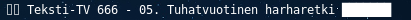
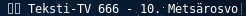

py3status-cmus
==============

This is a module for py3status_ to control and show information related to cmus_ music player.

py3status-cmus allows sending basic control commands to local or remote cmus by mouse button presses on i3 status bar.

.. _py3status: https://github.com/ultrabug/py3status

.. _cmus: https://cmus.github.io/

**Examples**

*Playing*

.. image:: doc/img/playing_progress_bar.png

*Paused*

*Stopped*

*Paused (no progress bar)*

Requirements
------------

It is assumed that you have working i3bar with py3status already installed.
If not, look at py3status install_ for more information.

.. _install: https://github.com/ultrabug/py3status#installation

Make sure that *cmus-remote* can be found in your PATH.

.. code::

	$ which cmus-remote
	/usr/bin/cmus-remote

Installing
----------

Clone the repository to preferred location:

.. code::

	$ git clone https://github.com/oljo/py3status-cmus.git

py3status modules are normally installed in ~/.i3/py3status/ directory.

If this directory doesn't exist you should create it:

.. code::

        $ mkdir ~/.i3/py3status/

Copy cmus_status.py to py3status directory:

.. code::

	$ cp py3status-cmus/cmus_status.py ~/.i3/py3status/

Enable the module in your py3status config:

.. code::

	order += "cmus_status"

Configuration
-------------
cmus_status.py has few variables which can be used to configure the status output:

.. code:: python
	
	STATUS_OUTPUT_FORMAT = "%status% %artist% - %tracknumber%. %title%"
	CMUS_NOT_RUNNING_MSG = "Cmus: not running."
	NOTHING_PLAYING_MSG = "Nothing playing."
	SHOW_PROGRESS_BAR = True
	PROGRESS_BAR_STYLE = {1: u"█",
        	              2: u" " }
	PROGRESS_BAR_LENGTH = 10
	
	# Status symbols
	PLAY_SYM  = u"▷"
	PAUSE_SYM = u"⌷⌷"
	STOP_SYM  = u"◻"

**STATUS_OUTPUT_FORMAT** defines the basic format for the output status.

Variables defined between %-characters should match to **cmus-remote -Q** output with *set* and *tag* omitted.

e.g. in following example %genre% would match to "Folk Rock".

.. code::

	$ cmus-remote -Q
	status playing
	file /home/user/music/Bob Dylan - Nashville Skyline/Bob Dylan - Girl From The North Country.flac
	duration 224
	position 15
	tag album Nashville Skyline
	tag artist Bob Dylan
	tag date 1969
	tag genre Folk Rock
	tag title Girl From The North Country
	tag tracknumber 01
	set aaa_mode all
	set continue true
	set play_library true
	set play_sorted false
	set replaygain disabled
	set replaygain_limit true
	set replaygain_preamp 0.000000
	set repeat false
	set repeat_current false
	set shuffle false
	set softvol false
	set vol_left -1
	set vol_right -1

**CMUS_NOT_RUNNING_MSG** and **NOTHING_PLAYING_MSG** are status outputs when cmus is not running or if nothing is playing in cmus.

These can be set to "" to get empty status string.

To disable progress bar set **SHOW_PROGRESS_BAR** to False.
**PROGRESS_BAR_LENGTH** defines length of the progress bar in characters.

.. code:: python

	CMUS_CMD  = "cmus-remote"
	CMUS_ARGS = ["-Q"]

**CMUS_ARGS** defines arguments that are forwared to cmus-remote.
If you use different socket than default ~/.cmus/socket or you want status from remote cmus, you can specify it by using "--server" argument.

e.g.

.. code:: python

	CMUS_ARGS = ["-Q", "--server", "<SOCKET or IP>", "--passwd", "<CMUSPASS>"]

.. code:: python

	CACHE_UNTIL = 0.5

**CACHE_UNTIL** defines how often status is updated (in seconds).

On click
--------

Default configuration maps left mouse click to play/pause and buttons 9 and 8 (forward & backward) to next and previous song.
These mappings can be changed by editing ON_CLICK_MAP dictionary in cmus_status.py

.. code:: python
	
	ON_CLICK_MAP = {1 : [CMUS_CMD] + ["-u"], # Play/pause
	                9 : [CMUS_CMD] + ["-n"], # Next track
        	        8 : [CMUS_CMD] + ["-r"]  # Previous track
               		}

xev_ can be used to find out mouse button numbers.

.. _xev: https://www.x.org/archive/X11R7.7/doc/man/man1/xev.1.xhtml
